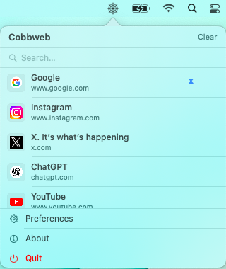

# Cobbweb

**A native macOS menu bar app that silently captures every web link you copy — enriched with page titles and favicons, searchable by meaning, stored entirely on-device.**

No accounts. No cloud sync. No telemetry. Just your links.

---

## Features

- **Automatic capture** — polls your clipboard every 1.5 seconds and saves any `http://` or `https://` URL you copy, skipping duplicates silently
- **Rich metadata** — fetches page titles and favicons via `LPMetadataProvider`, with a Google favicon fallback for sites that block scrapers (Google, YouTube, etc.)
- **On-device semantic search** — powered by Apple's `NaturalLanguage` framework; understands meaning, not just exact words; no network requests, no external LLMs
- **Pin links** — pin important links to float them above the list; they survive new captures and persist across restarts
- **Configurable limits** — keep between 10 and 200 links; choose how many rows are visible at once
- **Launch at login** — optional, using `SMAppService` on macOS 13+ with a legacy fallback
- **Private by default** — all data stored at `~/Library/Application Support/Cobbweb/links.json` with `0600` permissions; no other user or process can read it

---

## Screenshots

<p align="center">
  
</p>

---

## Requirements

| | Minimum |
|---|---|
| macOS | 12.0 Monterey |
| Xcode | 15.0 |
| Swift | 5.9 |

---

## Building

```bash
git clone https://github.com/your-username/cobbweb.git
cd cobbweb
open Cobbweb.xcodeproj
```

Select the **Cobbweb** scheme, choose your Mac as the run destination, and press `⌘R`.

> Cobbweb uses no external dependencies — no Swift Package Manager packages required.

---

## Running Tests

Press `⌘U` in Xcode, or run from the command line:

```bash
xcodebuild test -project Cobbweb.xcodeproj -scheme Cobbweb -destination 'platform=macOS'
```

| Test Suite | Coverage |
|---|---|
| `SavedLinkTests` | Model init, `searchableProfile`, `Codable` round-trip, `Equatable` |
| `URLValidationTests` | Valid/invalid schemes, edge cases, case insensitivity |
| `ClipboardMonitorTests` | Link management, deduplication, remove, clear, `extractURL` |
| `LinkStoreTests` | Save/load round-trip, corruption recovery, file permissions (`0600`) |

---

## How It Works

### Clipboard Monitoring

A `Timer` fires every 1.5 s and checks `NSPasteboard.general.changeCount`. When it changes, the content is inspected. Only single-line `http://` or `https://` URLs with a valid host pass the filter — plain text, images, multiline content, and non-web schemes are ignored. Duplicate URLs are silently skipped.

### Rich Metadata

Each captured URL is passed to `LPMetadataProvider` to fetch the page title and favicon asynchronously. If `LPMetadataProvider` returns no icon (common for Google, YouTube, and sites that block scrapers), a fallback fetches the favicon via Google's public favicon service:

```
https://www.google.com/s2/favicons?domain=<host>&sz=64
```

Icons are not persisted — they are re-fetched on launch.

### Semantic Search

Search runs entirely on-device using Apple's `NaturalLanguage` framework.

**Model selection (most capable first):**

| Model | Availability | Behaviour |
|---|---|---|
| `NLEmbedding.sentenceEmbedding` | macOS 13+ | Full phrase understanding |
| `NLEmbedding.wordEmbedding` | macOS 12+ (always bundled) | Per-token best-match scoring |
| Substring fallback | All versions | Exact text match only |

**Scoring strategy:**
1. Exact substring match in any field → distance `0.0`, shown first as "Exact Matches"
2. Field-weighted semantic scoring: title (1.0) > host (0.8) > path words (0.6) > full URL (0.2)
3. Lexical boost: partial word overlap reduces distance by 20%
4. Links above the threshold are excluded
5. Remaining results sorted by ascending distance and shown as "Related"
6. Debounced 250 ms — no UI stutter while typing

Each link's **searchable profile** concatenates page title + host + URL path words (e.g. `/search-demo-article` → `"search demo article"`) + full URL, so even links without a fetched title are semantically discoverable.

> True cross-concept search (e.g. "curry" finding "tikka masala") requires macOS 13+ where `sentenceEmbedding` is reliably available.

### Persistence

Links are stored at:

```
~/Library/Application Support/Cobbweb/links.json
```

- Directory permissions: `700`
- File permissions: `600`
- Atomic writes — no corruption on force-quit
- Writes only on mutations (add, update, pin, remove, clear) — never on a timer
- All I/O on a background serial queue

---

## Architecture

**MVVM.** `ClipboardMonitor` is the ViewModel (`ObservableObject`) and drives all business logic. Views observe it via `@EnvironmentObject`. `SavedLink` is the Model. `LinkStore` is a protocol-based persistence layer injected into `ClipboardMonitor` for testability.

```
Cobbweb/
├── CobbwebApp.swift              # @main entry point; wires ⌘, to PreferencesView on macOS 13+
├── AppDelegate.swift             # NSStatusItem + NSPopover lifecycle and menu bar icon
│
├── Models/
│   └── SavedLink.swift           # Data model + Codable DTO + searchableProfile
│
├── Engine/
│   ├── ClipboardMonitor.swift    # ViewModel: clipboard polling, metadata, persistence, search
│   ├── LinkStore.swift           # Protocol + production (JSON) + mock implementations
│   ├── LoginItemManager.swift    # Launch at login via SMAppService (macOS 13+) with fallback
│   └── SemanticSearchEngine.swift# On-device NLEmbedding search with word/substring fallback
│
└── Views/
    ├── ContentView.swift         # Root popover: header, search bar, link list, menu rows
    ├── LinkRowView.swift         # Link row: open, copy, pin indicator, context menu
    ├── MenuRowItem.swift         # Preferences / About / Quit rows
    └── PreferencesView.swift     # Standalone preferences window

CobbwebTests/
├── SavedLinkTests.swift
├── URLValidationTests.swift
├── ClipboardMonitorTests.swift
└── LinkStoreTests.swift
```

---

## User Interactions

| Action | Result |
|---|---|
| Click menu bar icon | Opens popover |
| Click a link row | Opens URL in default browser, closes popover |
| Click copy icon | Copies URL to clipboard, shows checkmark for 1.5 s |
| Right-click a row | Context menu: Open / Copy / Pin (or Unpin) / Remove |
| Type in search bar | Semantic + substring search across all stored links |
| Click × in search bar | Clears search, restores full list |
| Click Clear | Confirmation alert → permanently deletes all links |
| Preferences | Opens preferences window (or `⌘,` on macOS 13+) |
| About | Opens standard macOS About panel |
| Quit | Terminates the app |

---

## Privacy & Security

- All data stays on device — no telemetry, no analytics, no accounts
- App Sandbox enabled (`com.apple.security.app-sandbox`)
- Storage file is `0600` — no other user or process can read captured URLs
- Semantic search runs entirely on-device — query text never leaves the machine
- Favicon fallback makes one outbound request per domain to `google.com/s2/favicons`
- Clipboard usage declared via `NSPasteboardUsageDescription`

---

## Performance

```
Max 200 links × ~200 bytes ≈ 40 KB on disk (maximum)

In-memory footprint at idle:
  SavedLink structs (no icons)   ~100 KB
  NSImage favicons (100 links)   ~4–8 MB
  NLEmbedding word model         ~50–100 MB (shared macOS system resource)
  Total process RSS              ~60–110 MB
```

---

## Contributing

Contributions are welcome. Please open an issue to discuss what you'd like to change before submitting a pull request.

1. Fork the repo
2. Create a feature branch (`git checkout -b feature/your-feature`)
3. Commit your changes
4. Push the branch and open a pull request

---

## License

MIT License — see [LICENSE](LICENSE) for details.
